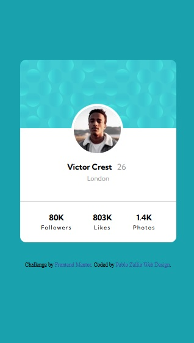
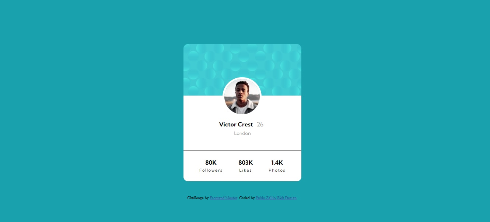

# Frontend Mentor challenge
## Profile card component main

### **Images**
##### Movile design

##### Desktop design

### **Description**

This project is a challenge from the website frontendmentor.com.
In it we can see a profile card made with HTML, CSS and Flexbox, its design model is "Movile first".

### **link**

https://zalliopablo.github.io/profile-card-component/

